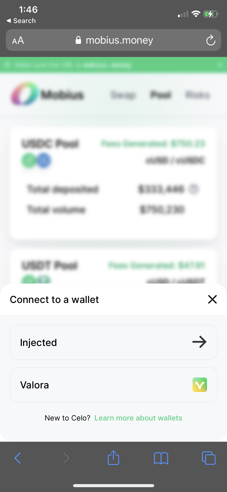
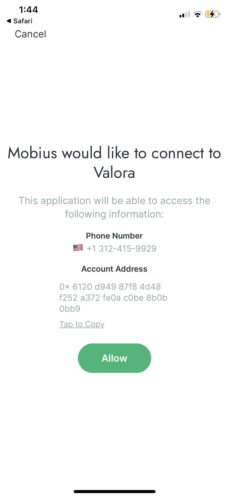
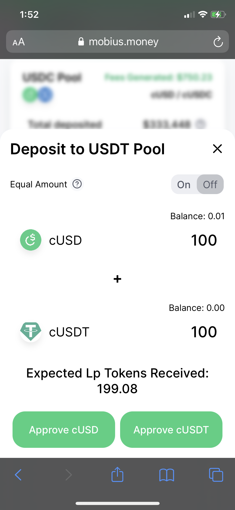

# Providing liquidity

## Why Provide Liquidity?

Liquidity Providers \(LPs\) are the heart and soul of Mobius. Like all AMMs, in order to facilitate swaps between assets, we need individuals to deposit tokens to our contract \(aka provide liquidity\). **LPs are compensated with trading fees \(currently 0.1%\)** for keeping their assets on Mobius. Eventually, LPs will also receive MOBI tokens \(Mobius governance tokens\) for providing liquidity. Unlike other AMMs such as Ubeswap, LPs on Mobius are not exposed to the risk of impermanent-loss, since the trade pairs should theoretically remain equal in value. 

## Step 1: Acquire Stablecoins

Mobius currently supports cUSD&lt;&gt;cUSDC. LPs can deposit any amount of either asset in the pair \(e.g. 100 cUSD and 500 cUSDC\), or just a single asset. To acquire cUSD, users can buy CELO on an exchange like Coinbase, then swap CELO for cUSD using Mento or [Ubeswap](https://ubeswap.org). To acquire cUSDC, a user can swap cUSD for cUSDC on Mobius, or they can mint new cUSDC using the Moss Bridge. More on that here.

## Step 2: Depositing to a Pool

Once you have cUSD or cUSDC, head over to the 'Pools' tab on the Mobius website. Click 'Deposit,' then enter the amount of tokens you would like to deposit. As a reminder, you can deposit any amount of cUSD and/or cUSDC. The first transaction will be to approve the token transfer and the second transaction will transfer the tokens from your wallet to the smart contract. Once completed, the 'Deposit' button should change to 'Manage' and you should see your pool balance to the left of it.

#### Step 2 \(a\) - Connect your wallet \(valora\) 

#### Step 2 \(b\) - Approve connection, press "allow."

#### Step 2 \(c\) - Find a pool you want to provide liquidity to!

#### Step 2 \(d\) - Deposit and approve each token on your wallet. 

## Step 3: Managing your Position

Once you have deposited to a pool, you should see the $ amount of your position. To modify it, click the 'Manage' button. This should reveal two new buttons: 'Deposit' and 'Withdraw.' Depositing more tokens is the same as step 2. Similar to depositing, users have two options when it comes to withdrawing: by equal token amounts or manually setting each token amount. Again you will need to accept two transactions: first the approval then the token transfer. 

#### Step 3 \(a\) - Approve transaction and see your deposit amount updated in the pool tab.

