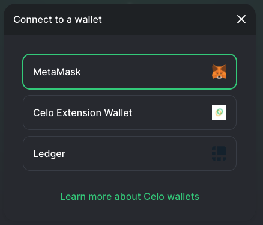
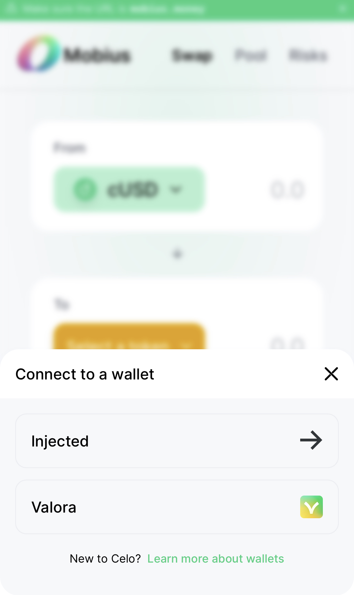

# Connecting wallets

In order to use the Mobius exchange, you must setup and connect to a Celo wallet. Mobius currently supports Valora, Ledger, Celo Web Extension, Metamask, and Wallet Connect. 

## Desktop Users

Our desktop users have the widest range of options. For simplest set up and use, we recommend the Celo Web Extension wallet. For extra security we recommend Celo Terminal, but this will require the use of Wallet Connect. If you have a Ledger Hardware Wallet, use it!

Web Extension Wallet: ****Make sure you have selected your wallet of choice on the web extension pop-up menu. Once you are on Mobius, click 'Connect to Wallet' in the lower left corner, then click 'Celo Web Extension.' The Celo Web Extension pop-up menu should appear; click 'Allow.' Your wallet address should appear in the lower left corner. 

Ledger Hardware Wallet: First, you need to download the 'Celo app' to your device \([guide](https://docs.celo.org/celo-owner-guide/ledger)\). Connect your device to your computer via USB, unlock it, and launch the Celo app. On the Mobius website, click 'Connect to Wallet' in the lower left corner, then click 'Ledger.'  Select the wallet index of your choice, then you should see your wallet address in the lower left corner.

## Mobile Users

For mobile users we highly recommend downloading the [Valora](https://valorapp.com) app, since it offers cash-in/out and is highly integrated throughout the Celo ecosystem. 

Once you are on Mobius, click 'Connect to Wallet' in the lower left corner, then click Valora. If you are on iOS, click 'Ok' on the pop-up message. This should take you to Valora, where you will need to authorize the connection to Mobius. Click 'Allow' then you will be redirected back to Mobius. You should now see either your wallet address in the lower left corner \(or phone number if you verified it in Valora\). 

